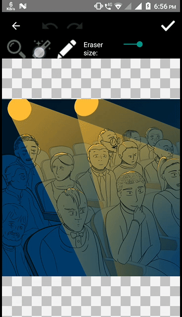

# BackgroundRemoval-Android
This app removes the background as well as object from the image. It is written using Kotlin.


## Usage

Add Gradle dependency:
```groovy
implementation 'com.github.gabrielbb:cutout:0.1.2'
```
### Getting the result
```java
override fun onActivityResult(requestCode: Int, resultCode: Int, @Nullable data: Intent?) {
        if (requestCode == CUTOUT_ACTIVITY_REQUEST_CODE.toInt()) {

            when (resultCode) {
                Activity.RESULT_OK -> {
                    val imageUri = getUri(data)
                    val bitmap = MediaStore.Images.Media.getBitmap(this.contentResolver, imageUri)

                    imageView.setImageBitmap(bitmap)
                }
            }

        }
    }
```




